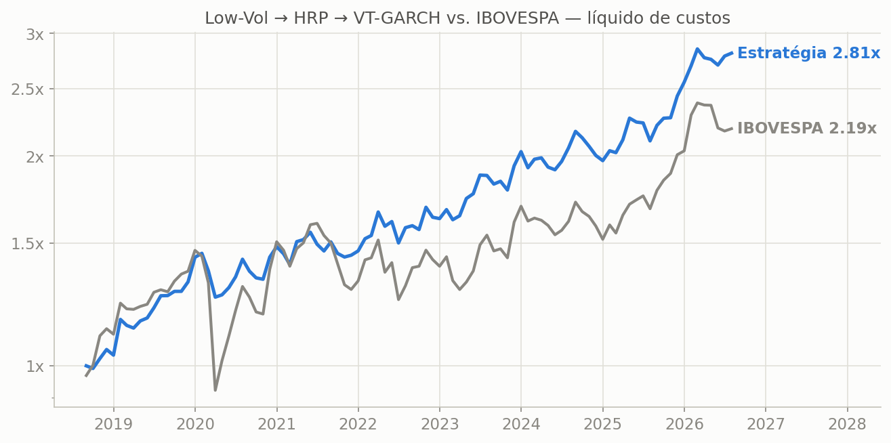
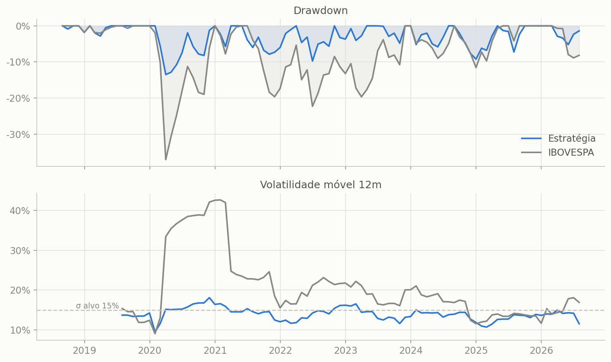
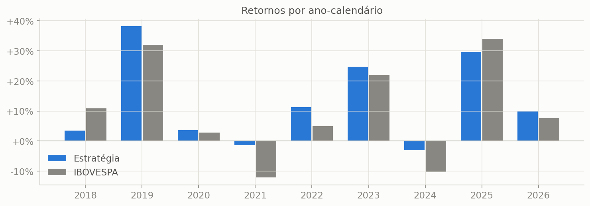

# Serenus

**Low-Vol → HRP → VT-GARCH no IBOVESPA** — *serenidade como fonte de alfa.*

> **Quant research**: Serenus é uma estratégia long-only sistemática sobre o universo do IBOVESPA — seleção defensiva por **baixa volatilidade**, alocação por **Hierarchical Risk Parity** e gestão de risco por **volatility targeting com GARCH(1,1)** — construída sobre uma base de dados própria, sem viés de sobrevivência, e comparada ao **IBOVESPA** como benchmark.

**Resultado (ago/2018 → jul/2026, 96 meses, líquido de custos):**

| | **Estratégia** | **IBOVESPA** |
|---|---:|---:|
| CAGR | **13,8%** | 10,3% |
| Volatilidade a.a. | **13,6%** | 21,2% |
| Máx. drawdown | **−13,5%** | −37,0% |
| Sortino | **2,07** | 0,60 |
| Calmar | **1,02** | 0,28 |
| Beta vs IBOV | 0,51 | 1,00 |
| Alfa a.a. | **+7,9%** | — |
| Anos-calendário vencidos | **7 de 9** | — |







A análise completa está no [notebook da estratégia](notebooks/estrategia_final.ipynb).

---

## 1. A estratégia

```
Universo IBOV (composição histórica mensal, sem viés de sobrevivência)
        │
        ▼
[1] LOW-VOL ────── vol realizada 252d; compra os 15 papéis MENOS voláteis
        │          (histerese: só sai quem cair do top-30 do ranking)
        ▼
[2] HRP ────────── pesos por clustering hierárquico da correlação
        │          (López de Prado 2016; covariância 252d, sem inverter Σ)
        ▼
[3] VT-GARCH ───── w = min(15% / σ̂, 1), com σ̂ = previsão GARCH(1,1)-t
        │          de 21 pregões; o (1−w) rende CDI
        ▼
Rebalance mensal, custos de 15 bps por lado sobre o giro (~37 bps/ano)
```

Cada camada tem papel claro e testado separadamente: o **low-vol** gera o alfa — a anomalia de baixa volatilidade (Ang et al., 2006; Blitz & van Vliet, 2007) paga de forma persistente num país de juro real alto, onde o custo de oportunidade pune ações arriscadas; o **HRP** organiza o risco dentro da cesta defensiva, onde a estrutura de correlação (utilities, seguradoras, consumo básico) é estável o bastante para o clustering agregar; e o **VT-GARCH** (Moreira & Muir, 2017; Bollerslev, 1986) corta as caudas nos extremos — exposição média de 92%, desalavancando para o CDI só quando a vol prevista dispara (COVID).

## 2. Os dados: IBOVESPA reconstruído sem viés de sobrevivência

Backtests em índices exigem a composição **histórica** — usar a carteira atual retroativamente infla resultados. A base foi construída em três camadas:

1. **Composição mensal dez/2015 → jun/2026** (127 datas, 137 tickers): base histórica até nov/2022 obtida de fonte pública e verificada por checagens de consistência (tickers, continuidade e cobertura de preços), estendida por engenharia reversa dos rebalanceamentos quadrimestrais da B3 — 11 janelas validadas por dupla contagem, com a lista oficial de mai/2026 batendo **exatamente** com a derivação rolada (zero drift) — e **31 eventos extraordinários** aplicados mês a mês (RJs: AMER3, GOLL4, AZUL4; OPAs: ENBR3, CIEL3, CRFB3, JBSS3; fusões: AZZA3, MBRF3; trocas de ticker: BHIA3, MOTV3, AXIA, ISAE4...).
2. **Preços ajustados**: Yahoo Finance para as séries vivas + **COTAHIST oficial da B3** para os ~22 tickers delistados que o Yahoo purgou, ajustados por **260 eventos societários pesquisados** (bonificações da CIEL3, splits do Banco Inter, grupamentos, dividendos/JCP por papel). Cobertura final: **99,87%** dos membro-meses.
3. **CDI oficial** (BCB/SGS 4391) para a perna de caixa do VT.

Detalhes: [`docs/research_composicoes_resumo.md`](docs/research_composicoes_resumo.md) e os dossiês de literatura em [`docs/research/`](docs/research/).

## 3. Estrutura do repositório

```
├── data/                       # composição mensal, painel de preços ajustados, CDI,
│                               #   eventos societários (brutos baixáveis pelos scripts)
├── docs/research/              # dossiês: HRP e VT+GARCH (com referências)
├── notebooks/                  # a estratégia final, executada (+ HTML)
├── reports/figures/            # figuras do resultado final
├── scripts/                    # download de dados (Yahoo, COTAHIST) e build da base
├── src/ibovquant/              # o pacote: data, sinais (low-vol, seleção), hrp,
│                               #   garch, vol_targeting, backtest, metrics
└── tests/                      # sanidade: look-ahead, custos, histerese, HRP, VT
```

## 4. Reprodução

```bash
pip install -r requirements.txt

# testes de sanidade (look-ahead, custos, histerese, HRP, VT)
pytest tests/ -q

# a estratégia (os dados finais já acompanham o repositório, em data/)
jupyter notebook notebooks/estrategia_final.ipynb

# opcional — reconstruir o painel do zero (~10 min)
python scripts/download_precos.py        # Yahoo Finance -> data/
python scripts/download_cotahist.py      # B3 COTAHIST -> data/
python scripts/monta_painel_precos.py    # painel ajustado por eventos -> data/
```

Convenções de rigor: sinal calculado com dados até o fim do mês *m* e carregado em *m+1* (sem look-ahead); universo elegível = membro do IBOV **naquele mês** (sem sobrevivência); comparações sempre em **amostra comum**; custos explícitos; parâmetros definidos a priori com base na literatura e mantidos fixos, sem otimização in-sample.

## 5. Referências principais

Ang, Hodrick, Xing & Zhang (2006, *JF*) e Blitz & van Vliet (2007, *JPM*) — anomalia de baixa volatilidade; López de Prado (2016, *JPM*) — HRP ([SSRN 2708678](https://papers.ssrn.com/sol3/papers.cfm?abstract_id=2708678)); Bollerslev (1986) e Hansen & Lunde (2005) — GARCH(1,1); Moreira & Muir (2017, *JF*) e Harvey et al. (2018, *JPM*) — volatility targeting; Blitz, Pang & van Vliet (2013, *Emerging Markets Review*) — o efeito de baixa volatilidade em mercados emergentes, incl. Brasil; França (2017, dissertação, Insper) — a anomalia na B3. Listas completas e comentadas em [`docs/research/`](docs/research/).

---

**Licença:** [MIT](LICENSE).

**Aviso:** projeto de pesquisa/educacional. Nada aqui constitui recomendação de investimento. Resultados de backtest não garantem desempenho futuro.
